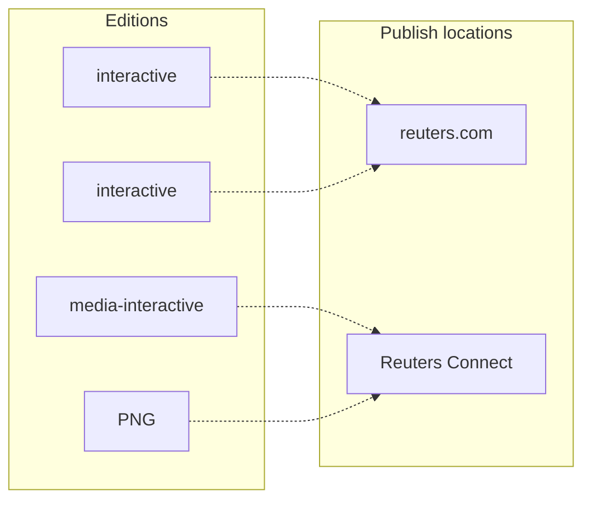

import { Aside, FileTree } from '@astrojs/starlight/components';

Graphics in the Sphinx graphics server are composed of three parts:

- **Graphic pack**: An overall graphics project, which includes at least one editon published to either reuters.com readers or media clients through Reuters Connect.
- **Archive**: A ZIP file uploaded to the graphics server that includes one or more editions.
- **Edition**: Collection of files that make up an embeddable or editable graphic or a graphics page.

## Graphic packs

Within the graphics server, a graphic pack looks like a collection of ZIP files with nested folders. ZIP files are **archives** and folders nested below them, **editions**.

<FileTree>
- public.zip <small>Archive</small>
  - interactive <small>Edition</small>
  - media-interactive <small>Edition</small>
- media-en-page.zip <small>Archive</small>
  - interactive <small>Edition</small>
  - media-interactive <small>Edition</small>
- media-en-map.zip <small>Archive</small>
  - interactive <small>Edition</small>
  - media-interactive <small>Edition</small>
  - PNG <small>Edition</small>
  - EPS <small>Edition</small>
- media-es-map.zip <small>Archive</small>
  - interactive <small>Edition</small>
  - media-interactive <small>Edition</small>
  - JPG <small>Edition</small>
  - EPS <small>Edition</small>
</FileTree>

## Archives

Generally, archives represent individual graphics or a collection of HMTL pages that are published to one of the [available publishing locations](http://localhost:4321/graphics-kit-publisher/sphinx/#where-editions-are-published). An archive must contain at least one edition.

<FileTree>
- media-en-page.zip <small>Archive</small>
  - interactive <small>Edition</small>
  - media-interactive <small>Edition</small>
</FileTree>

On your local file system, archives are structured with an **archive** folder and one or more nested **editon** folders:

<FileTree>
- media-en-page <small>Archive</small>
  - interactive <small>Edition</small>
    - ...
  - media-interactive <small>Edition</small>
    - ...
</FileTree>

When using the publisher, archives will be named according to one of the following conventions:

- `public.zip`
- `media-{locale code}-{slug}.zip`

Locale codes are any [valid language code](https://reuters-graphics.github.io/graphics-server-client/types/RNGS.Language.html) like `en`, `de` or `es`.

A slug is an ID used to identify the archive and the graphic it contains, like `map`, `bar-chart` or `page`.

## Editions

Editions represent a specific _format_ of a graphic that can be published to one of the [available publishing locations](http://localhost:4321/graphics-kit-publisher/sphinx/#where-editions-are-published).

#### Root files

Each edition must also have a **root file** located at the root of the edition folder. The type of file determines what format of graphic the edition contains and will drive what publishing options are avilable on the graphics server.

When determining what is the edition's root file, `.html` files take precedence. Other commonly used root edition file types: `.txt`, `.jpg`, `.png`, `.pdf`. Note that if multiple files of the same type are present at the root, the first file added to the zip will be the root edition file. At present, **it is not possible to control which file is added first.**

### Interactive editions

<FileTree>
- public <small>Archive</small>
  - interactive <small>Edition</small>
    - **index.html** <small>Root file</small>
    - more-pages
      - index.html
      - ...
    - assets
      - styles.css
      - scripts.js
    - _gfxpreview.png <small>Preview image</small>
</FileTree>

Interactive editions contain one or more HTML pages to be published on reuters.com.

The root file is `index.html`.

In most cases, additional HTML files should be at least one directory deeper than the root edition file. CSS, JS and images _can_ be at the same level as `index.html`.

A `_gfxpreview.png` or `_gfxpreview.jpg` image must also be at the root of the edition folder, which will be used to preview the edition in the graphics server, Lynx and Reuters Connect.

### Media-interactive editions

<FileTree>
- media-en-page <small>Archive</small>
  - media-interactive <small>Edition</small>
    - **README.txt** <small>Root file</small>
    - app.zip
    - _gfxpreview.png
</FileTree>

Media-interactive editions contain a ZIP archive of the project and represent a embeddable graphic that can be purchased on Reuters Connect or embedded into a reuters.com story in Lynx or Arc.

The root file is `README.txt`.

A `_gfxpreview.png` or `_gfxpreview.jpg` image must also be at the root of the edition folder, which will be used to preview the edition in the graphics serve, Lynx and Reuters Connect.

### Static file editions

<FileTree>
- media-en-page <small>Archive</small>
  - JPG <small>Edition</small>
    - **map.jpg** <small>Root file</small>
  - PNG <small>Edition</small>
    - **map.png** <small>Root file</small>
  - EPS <small>Edition</small>
    - **my-map.eps** <small>Root file</small>
    - map.jpg
  - PDF <small>Edition</small>
    - **my-map.pdf** <small>Root file</small>
</FileTree>

Static file editions represent static image versions of graphics, like JPEGs and PNGs, or editable versions like EPS or PDF files.

The root file can be named anything but should be of the same file type as the name of the edition, e.g., `PNG` -> `map.png`.

## Where editions are published

Editions are ultimately published to readers on reuters.com or to media clients through Reuters Connect.

### Publishing options

Publishing options are available on individual embeds and determine if and where graphics are published.

#### Available locations

- **Public RNGS** : Published to a public URL on reuters.com. This option is only available to [interactive editions](#interactive-editions).
- **Media** : Published as a purchasable graphic on Reuters Connect. This option is only available to [media interactive editions](#media-interactive-editions) and [static file editions](#static-file-editions).

#### Searchable

Editions can also be made **Searchable in Lynx**, which makes them available to embed in other reuters.com stories through embed tools in Lynx editor and Arc.

<Aside type="caution">
Only [media interactive editions](#media-interactive-editions) and [static file editions](#static-file-editions) should be made searchable in Lynx. 

The publisher handles this for you if you publish your project from the terminal.
</Aside>